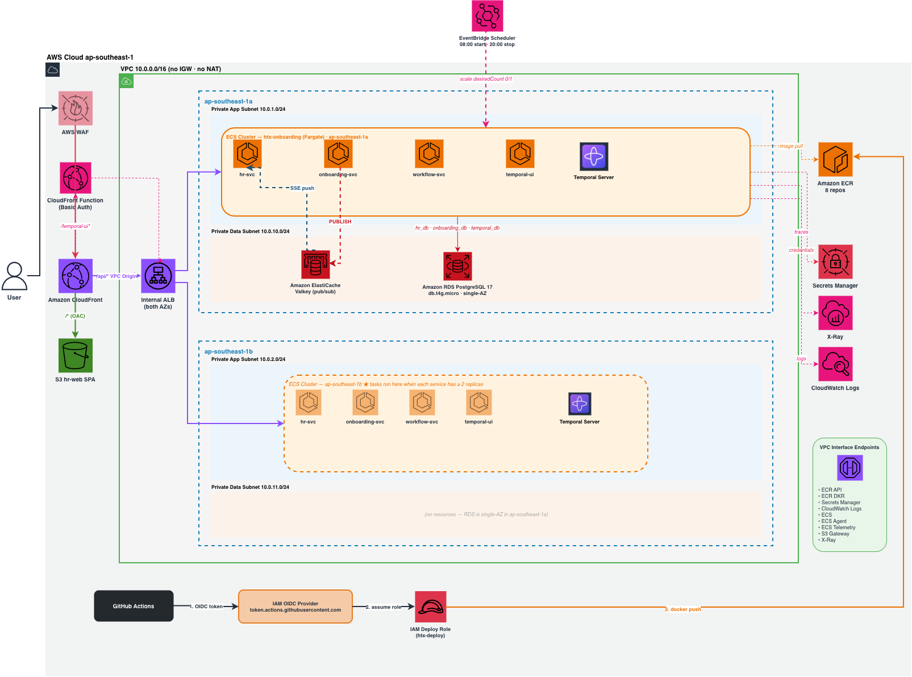
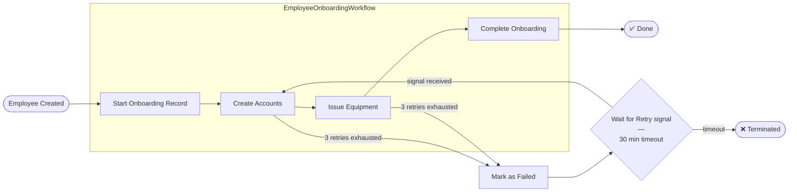

# HTX Enterprise Integration — Employee Onboarding System

## Overview

Integration between an **HR System** and an **Onboarding System**, orchestrated by **Temporal**. Creating an employee triggers a durable workflow that runs account creation and equipment issuance sequentially — with per-activity retries, pause-on-failure, and signal-based resume.

---

## Table of Contents

1. [Overview](#overview)
2. [Architecture](#architecture)
3. [How It Works](#how-it-works)
4. [Tech Stack](#tech-stack)
5. [Project Structure](#project-structure)
6. [Getting Started](#getting-started)
7. [Database Migrations](#database-migrations)
8. [Service URLs](#service-urls)
9. [API Reference](#api-reference)
10. [Testing](#testing)
11. [CI / CD](#ci--cd)
12. [Seed Data](#seed-data)
13. [Design Decisions](#design-decisions)

---

## Architecture

### Cloud Infrastructure (AWS)



> Deployed to `ap-southeast-1` via CloudFormation. See [ops/aws/README.md](ops/aws/README.md) for full infrastructure details, cost breakdown, and deployment guide.

**Live deployment:** <https://dx1rxjawwi5zt.cloudfront.net>

> Temporal UI is at `/temporal-ui` with basic auth — credentials: `admin` / `P@ssw0rd`

### Local / Service Architecture

> See [ops/local/README.md](ops/local/README.md) for the full architecture diagram and infrastructure details.

---

## How It Works

### Workflow Flow

When an employee is created in `hr-svc`, a Temporal workflow is triggered. The workflow runs four activities in sequence. On failure, the workflow pauses and waits for an HR user to click Retry. However, completed steps are skipped on retry.



### Failure and Retry Handling

Each Temporal activity is configured with:

```text
Max Attempts:        3
Initial Interval:    2 seconds
Backoff Coefficient: 2.0 (exponential)
Max Interval:        30 seconds
Timeout per attempt: 5 minutes
```

After all 3 activity attempts fail, the workflow:

1. Calls `FailOnboardingAsync` — marks the DB record as `failed`
2. Pauses at `WaitConditionAsync` — waits up to 30 minutes for a Retry signal
3. On signal: calls `ResetOnboardingStatusAsync`, then retries only the failed step (steps already done are skipped via `accountsDone` / `equipmentDone` flags)
4. On timeout: throws `ApplicationFailureException(nonRetryable: true)` — workflow terminates

### Retry Button Behaviour

When HR clicks **Retry Workflow**:

1. `workflow-svc` tries to send a `RetryAsync` signal to the running (paused) workflow
2. If the signal succeeds, the workflow resumes from the failed step — no new execution
3. If the signal fails (workflow already terminated or never started), a new workflow execution will be created. The first activity POSTs to `onboarding-svc` to create an onboarding record; if one already exists it gets a `409 Conflict`, resets the status to `in_progress`, and reuses the existing record

---

## Tech Stack

| Layer        | Technology                                        |
| ------------ | ------------------------------------------------- |
| Frontend     | React 19 + Vite + TypeScript + Tailwind CSS       |
| Backend      | .NET 10 ASP.NET Core (MVC Controllers)            |
| Workflow     | Temporal (Go server) + Temporalio .NET SDK        |
| Database     | PostgreSQL 18 (Flyway migrations)                 |
| ORM          | Dapper + Npgsql                                   |
| Pub/Sub      | Valkey 9 (Redis-compatible) + StackExchange.Redis |
| Live Updates | Server-Sent Events (SSE)                          |
| Container    | Docker / Podman + Compose                         |

---

## Project Structure

```text
/
├── hr-svc/                   HR System API (.NET 10)
├── hr-svc.Tests/             Unit tests for hr-svc
├── onboarding-svc/           Onboarding System API (.NET 10)
├── onboarding-svc.Tests/     Unit tests for onboarding-svc
├── workflow-svc/             Temporal Worker + API (.NET 10)
├── workflow-svc.Tests/       Unit tests for workflow-svc
├── hr-web/                   Frontend (React 19 + Vite + TypeScript)
├── hr-db/                    Flyway migrations for hr_db
│   └── migrations/
├── onboarding-db/            Flyway migrations for onboarding_db
│   └── migrations/
└── ops/
    ├── aws/                  AWS CloudFormation deployment
    │   ├── templates/        CloudFormation YAML stacks
    │   ├── helpers/          Helper scripts for DB init and migrations
    │   ├── docs/             Architecture diagram + infrastructure README
    │   ├── 1-deploy.sh       Full provision + deploy to AWS
    │   └── 2-tear-down.sh    Tear down all AWS stacks
    └── local/                Local dev environment
        ├── start-full.sh     Start infra + app services
        ├── start-infra.sh    Start infra only (postgres + temporal + valkey)
        ├── stop-full.sh      Stop everything
        ├── stop-infra.sh     Stop infra only
        ├── reset-data.sh     Reset Postgres + Temporal together (recommended)
        ├── reset-postgres.sh Drop and recreate Postgres databases
        ├── reset-temporal.sh Drop and recreate Temporal databases
        └── templates/        Docker Compose stacks (one per service)
            ├── postgres/     PostgreSQL container + init SQL
            ├── temporal/     Temporal server + UI + admin tools
            ├── valkey/       Valkey pub/sub broker
            ├── redisinsight/ Valkey web UI
            └── services/     Application services (hr-svc, hr-web, etc.)
```

---

## Getting Started

### Running Locally

```bash
sh ops/local/start-full.sh    # start infra + all app services
sh ops/local/stop-full.sh     # stop everything

sh ops/local/start-infra.sh   # start infra only (postgres, temporal, valkey)
sh ops/local/stop-infra.sh    # stop infra only
```

See [ops/local/README.md](ops/local/README.md) for prerequisites, manual setup, running services without containers, reset scripts, and environment variables.

### Deploying to AWS

```bash
./ops/aws/1-deploy.sh           # provision and deploy everything
./ops/aws/2-tear-down.sh        # tear down all stacks to stop billing
```

See [ops/aws/README.md](ops/aws/README.md) for prerequisites, infrastructure details, cost breakdown, and the full deployment guide.

---

## Database Migrations

Database state is maintained through versioned migrations managed by **Flyway**. Rather than manually running SQL scripts or resetting the database on every restart, Flyway tracks exactly which migrations have already been applied and only runs the ones that haven't — so the database state is always consistent and cumulative across restarts.

Migration files are stored in `hr-db/migrations/` and `onboarding-db/migrations/`, named `V<unix-timestamp>__<description>.sql`. Unix timestamps keep migrations from both services in chronological order without conflicts. On startup, the `hr-db-migrate` and `onboarding-db-migrate` containers run Flyway against the shared PostgreSQL instance. Applied migrations are recorded in a `flyway_schema_history` table and skipped on subsequent runs, so re-running `start-full.sh` against a live database is safe — existing data is left alone. `flyway.validateOnMigrate=true` ensures Flyway fails fast if a previously applied file is edited, preventing silent schema drift.

On AWS, migrations run the same way but as one-shot ECS Fargate tasks. `ops/aws/helpers/migrate.sh` registers a task definition, runs it against the RDS instance with credentials pulled from Secrets Manager, waits for the task to stop, then checks the exit code. Same Flyway idempotency applies — it's safe to run on every deploy.

To wipe everything and start fresh:

```bash
sh ops/local/reset-data.sh
```

This drops and recreates the databases, then re-runs migrations and seed data from scratch.

---

## Service URLs

| Service                | URL                             | Description               |
| ---------------------- | ------------------------------- | ------------------------- |
| hr-web                 | <http://localhost:3000>         | Frontend UI               |
| hr-svc                 | <http://localhost:5001>         | HR API                    |
| hr-svc Swagger         | <http://localhost:5001/swagger> | HR API docs               |
| onboarding-svc         | <http://localhost:5002>         | Onboarding API            |
| onboarding-svc Swagger | <http://localhost:5002/swagger> | Onboarding API docs       |
| workflow-svc           | <http://localhost:5003>         | Workflow API              |
| Temporal UI            | <http://localhost:8080>         | Workflow monitoring       |
| PostgreSQL             | `localhost:54320`               | Database (local dev port) |

---

## API Reference

Swagger UI is available for `hr-svc` and `onboarding-svc` when running locally:

- `http://localhost:5001/swagger` — HR Service
- `http://localhost:5002/swagger` — Onboarding Service
- `http://localhost:5003/swagger` — Workflow Service

### HR Service (`hr-svc`) — Port 5001

| Method | Endpoint                                   | Description                                           |
| ------ | ------------------------------------------ | ----------------------------------------------------- |
| GET    | `/health`                                  | Health check                                          |
| GET    | `/api/hr/employees`                        | List all employees                                    |
| GET    | `/api/hr/employees/{id}`                   | Get employee by ID                                    |
| POST   | `/api/hr/employees`                        | Create employee + trigger onboarding                  |
| PATCH  | `/api/hr/employees/{id}/status`            | Update employee status                                |
| GET    | `/api/hr/employees/{id}/onboarding`        | BFF proxy — get onboarding status from onboarding-svc |
| GET    | `/api/hr/employees/{id}/onboarding/stream` | BFF SSE proxy — live status stream (keep-alive)       |
| POST   | `/api/hr/employees/{id}/onboarding/retry`  | BFF proxy — retry workflow via workflow-svc           |

### Onboarding Service (`onboarding-svc`) — Port 5002

| Method | Endpoint                                       | Description                                      |
| ------ | ---------------------------------------------- | ------------------------------------------------ |
| GET    | `/health`                                      | Health check                                     |
| GET    | `/api/onboarding`                              | List all onboarding records                      |
| GET    | `/api/onboarding/employee/{employeeId}`        | Get onboarding status with all tasks             |
| GET    | `/api/onboarding/employee/{employeeId}/stream` | SSE stream — publishes status changes via Valkey |
| POST   | `/api/onboarding/start`                        | Start onboarding record (called by workflow)     |
| POST   | `/api/onboarding/{id}/accounts/create`         | Create account tasks                             |
| POST   | `/api/onboarding/{id}/equipment/issue`         | Issue equipment tasks                            |
| PATCH  | `/api/onboarding/{id}/status`                  | Update onboarding status + publish to Valkey     |

### Workflow Service (`workflow-svc`) — Port 5003

| Method | Endpoint                                       | Description                                                 |
| ------ | ---------------------------------------------- | ----------------------------------------------------------- |
| GET    | `/health`                                      | Health check                                                |
| POST   | `/api/workflows/onboarding/start`              | Start onboarding workflow                                   |
| POST   | `/api/workflows/onboarding/{employeeId}/retry` | Signal retry to paused workflow; start fresh if not running |

---

## Testing

### Test via UI

1. Open <http://localhost:3000>
2. Click **Add Employee**, fill in the form, and click submit
3. You will be redirected to the onboarding detail page
4. Watch tasks populate as the Temporal workflow executes

### Test via curl

```bash
# Create a new employee
curl -X POST http://localhost:5001/api/hr/employees \
  -H "Content-Type: application/json" \
  -d '{
    "firstName": "John",
    "lastName": "Doe",
    "email": "john.doe@htx.gov.sg",
    "department": "Engineering",
    "position": "Software Engineer",
    "hireDate": "2026-05-26"
  }'

# Check onboarding status (use employeeId from above response)
curl http://localhost:5002/api/onboarding/employee/{employeeId}

# Retry onboarding workflow
curl -X POST http://localhost:5001/api/hr/employees/{employeeId}/onboarding/retry
```

### Monitor via Temporal UI

1. Open `http://localhost:8080` and select the **htx-onboarding** namespace
2. Find `onboarding-{employeeId}` under **Workflows**
3. View execution history, activity results, and signal events

**Search filters:**

```text
WorkflowId = "onboarding-<employeeId>"
ExecutionStatus = "Running"
```

**Custom search attributes registered for this project:**

| Attribute        | Type    | Example                       | Notes                              |
| ---------------- | ------- | ----------------------------- | ---------------------------------- |
| `EmployeeName`   | Text    | `EmployeeName = "John Doe"`   | Supports `LIKE "%partial%"` search |
| `EmployeeNumber` | Keyword | `EmployeeNumber = "EMP-0013"` | Exact match only                   |
| `Department`     | Keyword | `Department = "Engineering"`  | Exact match only                   |

### Unit Tests

Each service has a sibling test project. Tests cover all business logic and run without Docker, a database, or a running Temporal server.

| Project                 | What's tested                                                                                                                  |
| ----------------------- | ------------------------------------------------------------------------------------------------------------------------------ |
| `hr-svc.Tests/`         | WorkflowTriggerService, EmployeeService, EmployeesController, DTOs                                                             |
| `onboarding-svc.Tests/` | OnboardingRecordService, OnboardingController, ValkeyPublisher, DTOs                                                           |
| `workflow-svc.Tests/`   | OnboardingActivities, EmployeeOnboardingWorkflow, OnboardingWorkflowService, WorkflowsController, Models, TemporalClientHolder |
| `hr-web/src/__tests__/` | App, Navbar, api, StatusBadge, EmployeeListPage, AddEmployeePage, OnboardingDetailPage                                         |

**Coverage target: ≥ 80%** on all metrics. Infrastructure code (repositories, SSE endpoints, Temporal worker, web host) is excluded via `[ExcludeFromCodeCoverage]` and `coverlet.runsettings`.

| Service        | Tests | Lines | Branches | Functions |
| -------------- | ----- | ----- | -------- | --------- |
| hr-svc         | 33    | 100%  | 100%     | 100%      |
| onboarding-svc | 33    | 97.7% | 97.7%    | 97.7%     |
| workflow-svc   | 38    | 96.7% | 96.7%    | 96.7%     |
| hr-web         | 64    | 100%  | 88.57%   | 97.43%    |

#### Run .NET tests (from repo root)

```bash
dotnet test hr-svc.Tests/
dotnet test onboarding-svc.Tests/
dotnet test workflow-svc.Tests/
```

#### Run .NET tests with coverage (from repo root)

```bash
dotnet test hr-svc.Tests/ --settings hr-svc.Tests/coverlet.runsettings --collect:"XPlat Code Coverage"
dotnet test onboarding-svc.Tests/ --settings onboarding-svc.Tests/coverlet.runsettings --collect:"XPlat Code Coverage"
dotnet test workflow-svc.Tests/ --settings workflow-svc.Tests/coverlet.runsettings --collect:"XPlat Code Coverage"
```

> The first run of `workflow-svc.Tests/` downloads the Temporal test server binary (~50 MB). Subsequent runs use the cached binary and complete in under 2 seconds.

#### Run hr-web tests

```bash
cd hr-web
npm test              # single run
npm run test:watch    # watch mode
npm run test:coverage # with coverage report
```

---

## CI / CD

GitHub Actions runs on every push and PR.

### Pipeline overview

```
feat/**  ─►  install  ─►  build  ─►  test  ─►  scan
main     ─►  install  ─►  build  ─►  test  ─►  scan  ─►  break-build  ─►  migrate  ─►  promote  ─►  promote-temporal  ─►  tag-release
```

| Stage                | Runs on      | What it does                                                                   |
| -------------------- | ------------ | ------------------------------------------------------------------------------ |
| **install**          | all branches | Restore .NET packages, `npm ci`                                                |
| **build**            | all branches | Compile all services + build Docker images                                     |
| **test**             | all branches | xunit + Vitest with coverage; fails if any metric < 80%                        |
| **scan**             | all branches | SAST (Semgrep), dependency audit (Trivy + OWASP), secret scan (gitleaks)       |
| **break-build**      | `main` only  | Quality gate — blocks everything downstream if any stage above failed          |
| **migrate**          | `main` only  | `hr-db-migrate` + `onboarding-db-migrate` run as parallel Fargate tasks on RDS |
| **promote**          | `main` only  | Push images to GHCR, deploy app services to ECS, deploy hr-web to S3           |
| **promote-temporal** | `main` only  | Force-redeploy Temporal ECS service and re-bootstrap namespace                 |
| **tag-release**      | `main` only  | Auto-increment patch from `VERSION` file, push `release/x.y.z` git tag         |

### Workflow files

```
.github/workflows/
  ci-cd.yml     All stages: test → scan → break-build → promote
```

### Scan stages

| Job                     | Tool                   | What it checks                                     | Breaks build?                                 |
| ----------------------- | ---------------------- | -------------------------------------------------- | --------------------------------------------- |
| `scan-sast`             | Semgrep                | C#, TS/React, OWASP Top 10 patterns                | Yes — ERROR-severity findings                 |
| `scan-dependency-check` | Trivy `fs`             | All dependency manifests — NuGet, npm, OS packages | Yes — HIGH/CRITICAL CVEs                      |
| `scan-dependency-check` | OWASP Dependency-Check | Full NVD CVE audit, HTML report as artifact        | Yes — CVSS ≥ 7                                |
| `scan-secrets`          | gitleaks               | Full git history for leaked keys, tokens           | Yes — any secret found                        |
| (promote)               | Trivy `image`          | Built Docker images before push                    | Yes — image not pushed if HIGH/CRITICAL found |

### Images published to GHCR

On every merge to `main`, four images are tagged with the commit SHA and `latest`:

```
ghcr.io/<owner>/<repo>/hr-svc:<sha>
ghcr.io/<owner>/<repo>/onboarding-svc:<sha>
ghcr.io/<owner>/<repo>/workflow-svc:<sha>
ghcr.io/<owner>/<repo>/hr-web:<sha>
```

---

## Seed Data

Five employees are seeded via Flyway on a fresh database:

| Employee             | Dept            | Onboarding Status | What to test                                              |
| -------------------- | --------------- | ----------------- | --------------------------------------------------------- |
| Alice Tan (EMP-0001) | Engineering     | ✅ completed      | Completed state UI; no Retry button shown                 |
| Bob Lim (EMP-0002)   | Engineering     | 🔄 in_progress    | In-progress state; Retry re-triggers a stuck workflow     |
| Carol Ng (EMP-0003)  | Human Resources | 🔄 in_progress    | Same as Bob but different department                      |
| David Koh (EMP-0004) | Operations      | ⏳ pending        | Pending state; Start Workflow button kicks off onboarding |
| Eve Chan (EMP-0005)  | Cybersecurity   | ❌ failed         | Failed state; Retry resumes from the failed attempt       |

> These statuses are set directly by Flyway and reflect the initial state after a fresh `reset-data.sh`.
> Running Retry or Start Workflow on any employee will trigger a real Temporal workflow and update the database.

---

## Design Decisions

### Temporal

Temporal was picked over N8N or Apache Camel because the core requirement is sequential steps with retry and resumability. Workflow state is persisted in PostgreSQL, so a crashed worker picks up mid-execution on restart. Each activity gets a configurable retry policy with exponential backoff. When all retries are exhausted, the workflow pauses and waits for a signal rather than terminating, so HR can click Retry without losing progress. The `accountsDone` / `equipmentDone` flags in workflow state ensure already-completed steps are skipped on resume.

### Signal-based retry

When HR clicks Retry, a signal is sent to the paused workflow so it resumes from the failed step and there will be no duplicate work. A fresh execution is only started as a fallback if the workflow already terminated (30-minute timeout expired).

### .NET 10

The Temporal .NET SDK has strong typing across the workflow/activity boundary, which catches integration errors at compile time rather than runtime. .NET 10 also has significantly faster startup times and a lower memory footprint compared to older .NET versions, which matters in ECS Fargate where cold starts and container resource usage directly affect cost and responsiveness.

### Valkey + SSE for live updates

Each onboarding step runs inside a Temporal activity in the background. To push status changes to the browser without polling, `onboarding-svc` publishes to a Valkey channel after every update, and `hr-svc` (acting as BFF) subscribes and streams events to the browser over SSE.

Using Valkey as the pub/sub layer means that when multiple `onboarding-svc` instances are running, a status update published by any instance is broadcast to all subscribers, so every connected client gets notified regardless of which instance handled the request. SSE is used over WebSockets on the client side because the data only flows one way (server → browser), and SSE handles reconnection automatically without the overhead of a full-duplex protocol.

### Dapper over EF Core

Since Flyway already owns schema management, using EF Core migrations on top would be redundant and could conflict. Dapper fits naturally alongside Flyway since SQL is written directly and Flyway handles the schema. The data access patterns across all services are straightforward CRUD with no complex object graphs or relationships, so EF Core's change tracking and abstraction layer add unnecessary overhead.

### Assumptions

1. Integration is one-way: HR System → Onboarding System, no reverse sync
2. One workflow per employee; duplicate triggers return `409 Conflict` from the onboarding service
3. Account creation and equipment issuance are simulated — no real AD, email, or asset management system
4. No auth — all endpoints are open, this is a local/demo environment
5. Employee numbers (`EMP-XXXX`) are auto-incremented by the HR service
6. Both services share the same PostgreSQL instance under separate schemas (`hr`, `onboarding`) — in a real enterprise setup these would be isolated databases owned by separate teams
7. Workflow trigger is fire-and-forget — `hr-svc` returns the created employee immediately after signalling `workflow-svc`; onboarding runs fully async in the background
8. No rollback on partial failure — if equipment issuance fails after accounts are already created, the account step is not undone; retry resumes from the failed step only
9. Temporal workflow state is persisted in PostgreSQL, so it survives restarts and can be queried for debugging
10. Temporal activities have a retry policy of 3 attempts with exponential backoff; after that the workflow pauses and waits for a manual retry signal rather than terminating, to allow HR to fix transient issues without losing progress
11. The frontend is a simple React app that consumes the APIs and displays onboarding status; it's not a full-fledged HR portal with authentication, role-based access, or complex UI
