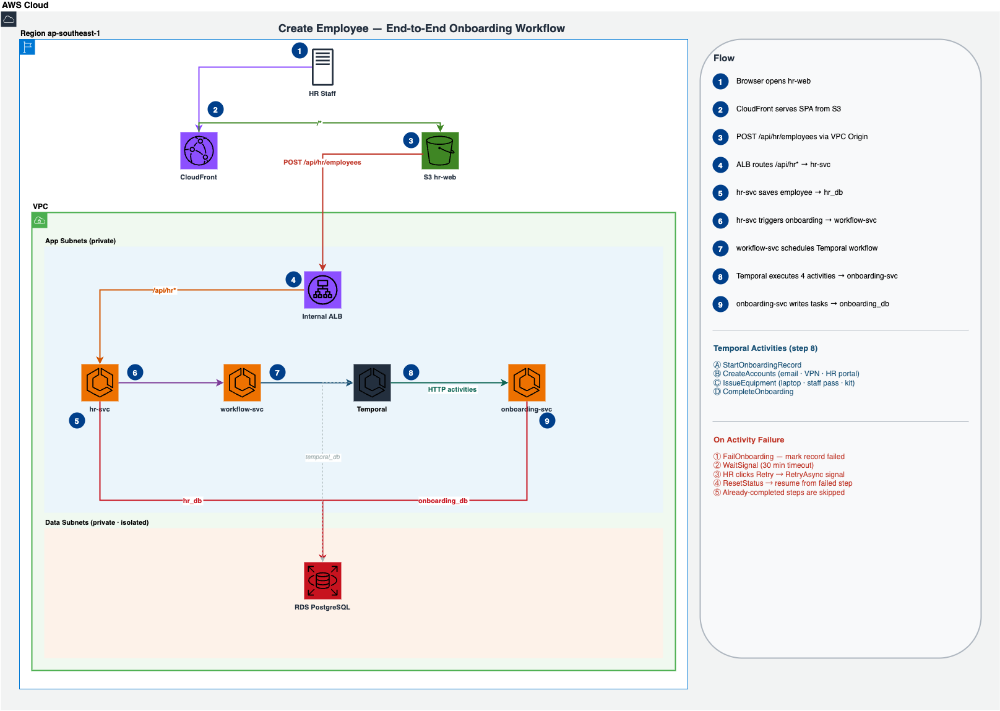

# HTX Onboarding — Infrastructure

> Part of [HTX Onboarding](../../README.md) — see the root README for architecture, API reference, and design decisions.

AWS CloudFormation stacks deploying the full HTX Onboarding system to `ap-southeast-1`.

---

## Architecture

> Full diagrams available in [htx-onboarding-architecture.drawio](./docs/htx-onboarding-architecture.drawio) (open with [draw.io](https://app.diagrams.net)).

### AWS Infrastructure


### Onboarding Flow



### SSE Live Updates


The network design is intentionally modelled after a real enterprise deployment where only the user-facing frontend should be reachable from the public internet. Backend services (APIs, database, cache, workflow engine) should not be publicly exposed, so everything runs in a fully private VPC with no Internet Gateway or NAT Gateway. This also serves as a security boundary where direct access to backend services or the database is not possible from the internet. In a real environment, any administrative access would go through a jumphost or JIT access mechanism.

CloudFront is the only public-facing endpoint. Static assets are served from S3 (public access blocked, OAC only) and API requests are routed to an internal ALB via VPC Origin, so backend traffic never touches the public internet.

ECS tasks are single-AZ (`ap-southeast-1a`). The ALB and subnet groups span both AZs only because AWS requires it, not for redundancy. Multi-AZ ECS and RDS read replicas are not provisioned here to reduce costs for this demo project, but they would be essential in a production environment.

VPC Interface Endpoints handle ECR pulls, Secrets Manager reads, and CloudWatch Logs so containers never need outbound internet access. Valkey (ElastiCache) sits in the data subnet and acts as the pub/sub broker for SSE live-status updates. GitHub Actions deploys via an OIDC-assumed IAM role with no long-lived credentials stored in GitHub.

---

## Stacks

Each template is an independent CloudFormation stack. Outputs are exported with
`htx-onboarding-{key}` names so downstream stacks import them via `Fn::ImportValue`.

| File                                 | Stack name                        | Description                                            |
| ------------------------------------ | --------------------------------- | ------------------------------------------------------ |
| `templates/0-github-oidc.yaml`       | `htx-onboarding-github-oidc`      | GitHub Actions OIDC role for CI/CD deploys             |
| `templates/1-network.yaml`           | `htx-onboarding-network`          | VPC, subnets, security groups, VPC endpoints           |
| `templates/2-ecr.yaml`               | `htx-onboarding-ecr`              | ECR repositories for all service images                |
| `templates/3-storage.yaml`           | `htx-onboarding-storage`          | RDS PostgreSQL, Secrets Manager                        |
| `templates/4a-compute-infra.yaml`    | `htx-onboarding-compute-infra`    | ECS cluster, Internal ALB, task definitions, Cloud Map |
| `templates/4b-temporal.yaml`         | `htx-onboarding-temporal`         | Temporal ECS service                                   |
| `templates/4c-compute-services.yaml` | `htx-onboarding-compute-services` | hr-svc, onboarding-svc, workflow-svc, temporal-ui      |
| `templates/5-cdn.yaml`               | `htx-onboarding-cdn`              | CloudFront distribution, S3 bucket, VPC Origin         |
| `templates/6-scheduler.yaml`         | `htx-onboarding-scheduler`        | EventBridge Scheduler — auto stop/start ECS services   |

---

## Resources Provisioned

### Networking (`1-network.yaml`)

| Resource                 | Details                                                                    | Hourly     | Daily     |
| ------------------------ | -------------------------------------------------------------------------- | ---------- | --------- |
| VPC                      | 10.0.0.0/16, DNS enabled                                                   | Free       | Free      |
| App Subnets              | 2 private subnets (AZ-a, AZ-b) — ALB + ECS                                 | Free       | Free      |
| Data Subnets             | 2 private subnets (AZ-a, AZ-b) — RDS                                       | Free       | Free      |
| Route Tables             | 2 (app, data) — local VPC routes only, no internet                         | Free       | Free      |
| Security Groups          | ALB, ECS, RDS, Valkey, VPC Endpoints                                       | Free       | Free      |
| S3 Gateway Endpoint      | Allows ECS to pull ECR image layers (stored in S3) without leaving the VPC | Free       | Free      |
| ECR API Endpoint         | Interface endpoint — image pull auth                                       | $0.0142/hr | $0.34/day |
| ECR DKR Endpoint         | Interface endpoint — image pull                                            | $0.0142/hr | $0.34/day |
| CloudWatch Logs Endpoint | Interface endpoint — container logs                                        | $0.0142/hr | $0.34/day |
| Secrets Manager Endpoint | Interface endpoint — DB credentials                                        | $0.0142/hr | $0.34/day |
| ECS Endpoint             | Interface endpoint — Fargate control plane                                 | $0.0142/hr | $0.34/day |
| ECS Agent Endpoint       | Interface endpoint — Fargate agent                                         | $0.0142/hr | $0.34/day |
| ECS Telemetry Endpoint   | Interface endpoint — Fargate telemetry                                     | $0.0142/hr | $0.34/day |

> The S3 Gateway Endpoint covers ECR image layer pulls from within the VPC. The hr-web SPA static assets live in a separate S3 bucket; CloudFront accesses that bucket directly via OAC and does not route through this endpoint.

### Storage (`3-storage.yaml`)

| Resource           | Details                                        | Hourly     | Daily     |
| ------------------ | ---------------------------------------------- | ---------- | --------- |
| RDS PostgreSQL     | db.t4g.micro, 20GB gp3, single-AZ, encrypted   | $0.0192/hr | $0.46/day |
| ElastiCache Valkey | cache.t4g.micro, single-node — pub/sub for SSE | $0.0008/hr | $0.02/day |
| Secrets Manager    | 5 secrets (DB passwords + connection strings)  | $0.0029/hr | $0.07/day |

### Containers (`2-ecr.yaml` + `4a/4b/4c-compute.yaml`)

| Resource                | Details                                                                                                              | Hourly                  | Daily      |
| ----------------------- | -------------------------------------------------------------------------------------------------------------------- | ----------------------- | ---------- |
| ECR Repositories        | 8 repos (hr-svc, onboarding-svc, workflow-svc, temporal, temporal-ui, db-init, hr-db-migrate, onboarding-db-migrate) | Free (500MB/repo/month) | Free       |
| ECS Cluster             | Fargate launch type                                                                                                  | Free                    | Free       |
| ECS — hr-svc            | 0.25 vCPU, 0.5 GB                                                                                                    | $0.0142/hr              | $0.34/day  |
| ECS — onboarding-svc    | 0.25 vCPU, 0.5 GB                                                                                                    | $0.0142/hr              | $0.34/day  |
| ECS — workflow-svc      | 0.25 vCPU, 0.5 GB                                                                                                    | $0.0142/hr              | $0.34/day  |
| ECS — temporal          | 0.5 vCPU, 1.0 GB                                                                                                     | $0.0283/hr              | $0.68/day  |
| ECS — temporal-ui       | 0.25 vCPU, 0.5 GB                                                                                                    | $0.0142/hr              | $0.34/day  |
| Internal ALB            | `Scheme: internal`, path-based routing                                                                               | $0.0008/hr              | $0.02/day  |
| CloudWatch Log Groups   | 5 groups, 14-day retention                                                                                           | ~$0.0004/hr             | ~$0.01/day |
| IAM Task Execution Role | ECR pull + Secrets Manager read                                                                                      | Free                    | Free       |
| Cloud Map Namespace     | `htx-network` — internal DNS for service-to-service                                                                  | $0.0013/hr              | $0.03/day  |

### CDN (`5-cdn.yaml`)

| Resource                | Details                                       | Cost               |
| ----------------------- | --------------------------------------------- | ------------------ |
| S3 Bucket               | hr-web static assets, public access blocked   | ~$0.00             |
| CloudFront OAC          | Origin Access Control for S3                  | Free               |
| CloudFront VPC Origin   | Connects CloudFront to internal ALB privately | Free               |
| CloudFront Distribution | HTTPS, path-based routing, SPA fallback       | ~$0.00 (free tier) |
| CloudFront Function     | Basic auth guard for Temporal UI              | Free               |

### Scheduler (`6-scheduler.yaml`)

| Resource             | Details                                                                          | Cost |
| -------------------- | -------------------------------------------------------------------------------- | ---- |
| IAM Role             | `htx-onboarding-scheduler` — grants EventBridge permission to call UpdateService | Free |
| Schedule Group       | `htx-onboarding` — logical grouping for all schedules                            | Free |
| Stop schedules (×5)  | Scale each ECS service to 0 at **20:00 SGT** daily                               | Free |
| Start schedules (×5) | Temporal at **08:00 SGT**, app services at **08:05 SGT** daily                   | Free |

> EventBridge Scheduler charges per invocation. 10 schedules × 1/day × 30 days = 300 invocations/month — well within the 14 million free tier limit.

---

## Cost Optimisation (Demo / Non-Production)

Two measures are applied to reduce cost for demonstration purposes without tearing down the infrastructure:

### 1. Single-AZ deployment

All ECS tasks are pinned to `ap-southeast-1a`. The ALB and subnet groups span two AZs only because AWS requires it for those resource types. There are no duplicate tasks or standby instances running in the second AZ. This halves the Fargate and VPC endpoint costs compared to a multi-AZ setup (which would be required in production for high availability).

### 2. EventBridge Scheduler — auto stop/start

ECS Fargate tasks are the only elastic cost in this architecture. The `6-scheduler.yaml` stack provisions 10 EventBridge schedules to automatically scale all five services to 0 at night and back to 1 in the morning:

| Schedule           | Time (SGT) | Action                                                  |
| ------------------ | ---------- | ------------------------------------------------------- |
| Stop all           | 20:00      | All 5 services → desiredCount 0                         |
| Start Temporal     | 08:00      | temporal → desiredCount 1 (healthy before apps connect) |
| Start app services | 08:05      | temporal-ui, hr-svc, onboarding-svc, workflow-svc → 1   |

Temporal starts 5 minutes before the app services to ensure it is healthy before `workflow-svc` attempts to connect.

Running **12 hours/day** instead of 24/7 cuts Fargate costs by ~50% (~$30/month saved). RDS, ElastiCache, ALB, and VPC endpoints run continuously as they are fixed base costs of the architecture with no pause feature.

To override the schedule and start/stop manually:

```bash
./ops/aws/start-services.sh   # scale all services up immediately
./ops/aws/stop-services.sh    # scale all services down immediately
```

---

## Cost Summary (ap-southeast-1, on-demand)

All AWS services are billed by the hour. Estimates assume 24/7 uptime.

| Category                           | Hourly     | Daily      | Monthly   |
| ---------------------------------- | ---------- | ---------- | --------- |
| VPC Interface Endpoints (7 × 1 AZ) | $0.0994    | $2.35      | $70.50    |
| ECS Fargate (5 tasks)              | $0.0851    | $2.04      | $61.20    |
| RDS db.t4g.micro                   | $0.0250    | $0.60      | $18.00    |
| ElastiCache Valkey cache.t4g.micro | $0.0008    | $0.02      | $0.60     |
| Secrets Manager                    | $0.0033    | $0.08      | $2.40     |
| Cloud Map                          | $0.0013    | $0.03      | $0.90     |
| ALB + CloudWatch                   | $0.0013    | $0.03      | $0.90     |
| CloudFront + S3 + ECR              | ~$0.00     | ~$0.00     | ~$0.00    |
| EventBridge Scheduler              | Free       | Free       | Free      |
| **Total (24/7)**                   | **~$0.21** | **~$5.15** | **~$155** |
| **Total (12hr/day via scheduler)** | —          | **~$4.12** | **~$124** |

> **Tip — tear down when not in use:**
>
> ```bash
> ./ops/aws/2-tear-down.sh
> ```

---

## Deployment

### Prerequisites

- AWS CLI configured with credentials for `ap-southeast-1`
- Docker or Podman (to build and push images to ECR)
- `jq` — `brew install jq`

### Scripts

Two scripts cover everything:

| Script                     | Purpose                                                |
| -------------------------- | ------------------------------------------------------ |
| `./ops/aws/1-deploy.sh`    | Full provision + deploy (run once, or on every update) |
| `./ops/aws/2-tear-down.sh` | Tear down all stacks to stop billing                   |

> `helpers/init-db.sh` and `helpers/migrate.sh` are internal helpers called automatically by `1-deploy.sh` — you never need to run them directly.

### Full Deploy

Provisions all stacks, builds and pushes images, runs DB migrations, bootstraps Temporal, and deploys hr-web to S3.

```bash
./ops/aws/1-deploy.sh           # deploy with latest image tag
./ops/aws/1-deploy.sh v1.2.3    # deploy a specific tag
```

What `1-deploy.sh` does in order:

1. Deploys GitHub OIDC role (idempotent)
2. Deploys network stack
3. Deploys ECR stack
4. Builds and pushes all Docker images to ECR
5. Deploys storage stack (RDS + Secrets Manager)
6. Writes RDS connection strings into Secrets Manager
7. Deploys compute-infra stack (ECS cluster, ALB, task definitions)
8. Initialises the database _(calls `helpers/init-db.sh` internally)_
9. Runs Flyway migrations _(calls `helpers/migrate.sh` internally)_
10. Deploys Temporal ECS service and waits for it to stabilise
11. Bootstraps Temporal namespace and search attributes
12. Deploys remaining app services (hr-svc, onboarding-svc, workflow-svc, temporal-ui)
13. Deploys CDN stack (CloudFront + S3)
14. Builds hr-web and syncs to S3, then invalidates CloudFront cache

### Tear Down

Tears down all stacks:

```bash
./ops/aws/2-tear-down.sh
```

### Temporal UI Credentials

Temporal UI sits behind HTTP Basic Auth via a CloudFront Function.

Default: `admin` / `P@ssw0rd`

HTTP Basic Auth encodes `username:password` as a base64 token sent in the `Authorization: Basic <token>` header. The CloudFront Function decodes and validates it on every request. The `-n` flag on `echo` strips the trailing newline so the encoded value is clean.

To change it, update `TEMPORAL_UI_BASIC_AUTH` in `1-deploy.sh` and redeploy the CDN stack:

```bash
export TEMPORAL_UI_BASIC_AUTH=$(echo -n 'admin:yournewpassword' | base64)
aws cloudformation deploy \
  --template-file templates/5-cdn.yaml \
  --stack-name htx-onboarding-cdn \
  --region ap-southeast-1 \
  --capabilities CAPABILITY_IAM \
  --no-fail-on-empty-changeset \
  --parameter-overrides TemporalUIBasicAuth="${TEMPORAL_UI_BASIC_AUTH}"
```
