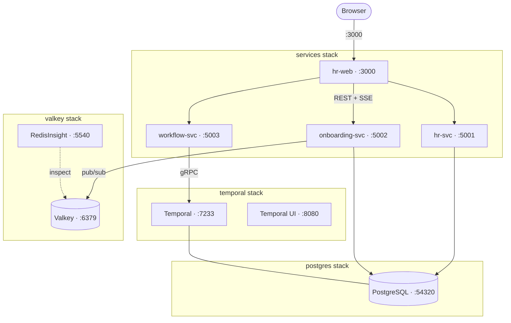

# HTX Onboarding — Local Environment

> Part of [HTX Onboarding](../../README.md) — see the root README for architecture, API reference, and design decisions.

Local infrastructure and scripts for running the HTX Onboarding system on your machine.

---

## Architecture

All services run as containers on a single shared Docker/Podman network (`htx-network`).



**Key design points:**

- **PostgreSQL 18** is the primary database for hr-svc and onboarding-svc; Temporal also uses its own PostgreSQL databases in the same stack
- **Valkey** (Redis-compatible) acts as the pub/sub broker for SSE live-status streaming, mirroring the ElastiCache setup in AWS
- **Application services** (hr-svc, onboarding-svc, workflow-svc, hr-web) are built from the local source and run in the `services` Compose stack
- **Flyway migrations** run automatically on `services` stack startup — the database schema is always in sync with the source

---

## Stacks

Each subdirectory under `templates/` is an independent Compose stack.

| Directory                          | Description                                                        | Port                                                                             |
| ---------------------------------- | ------------------------------------------------------------------ | -------------------------------------------------------------------------------- |
| `postgres/docker-compose.yaml`     | PostgreSQL 18, primary database for hr-svc and onboarding-svc      | `54320`                                                                          |
| `temporal/docker-compose.yaml`     | Temporal server + UI + admin tools, workflow orchestration engine  | `7233` (server), `8080` (UI)                                                     |
| `valkey/docker-compose.yaml`       | Valkey 9 (Redis-compatible), pub/sub broker for SSE live updates   | `6379`                                                                           |
| `redisinsight/docker-compose.yaml` | RedisInsight, web UI for inspecting Valkey channels and keys       | `5540`                                                                           |
| `services/docker-compose.yaml`     | Application services: hr-svc, onboarding-svc, workflow-svc, hr-web | `3000` (hr-web), `5001` (hr-svc), `5002` (onboarding-svc), `5003` (workflow-svc) |

---

## Scripts

| Script              | What it does                                                        |
| ------------------- | ------------------------------------------------------------------- |
| `start-full.sh`     | Creates network, starts all infra + app services                    |
| `start-infra.sh`    | Creates network, starts PostgreSQL + Valkey + Temporal only         |
| `stop-full.sh`      | Stops app services, then infra (reverse order)                      |
| `stop-infra.sh`     | Stops infra only                                                    |
| `reset-data.sh`     | Resets Postgres + Temporal together (recommended)                   |
| `reset-postgres.sh` | Drops and recreates the `htx` database, re-runs migrations          |
| `reset-temporal.sh` | Drops Temporal databases, restarts Temporal, re-registers namespace |

All scripts auto-detect `podman` or `docker` and are safe to re-run.

---

## Deployment

### Prerequisites

- Docker or Podman
- .NET 10 SDK — only needed for [running services without containers](#run-services-without-containers)
- Node.js 22+ — only needed for [running services without containers](#run-services-without-containers)

Create the shared Docker network once before starting any stack:

```bash
podman network create htx-network
```

> `start-full.sh` and `start-infra.sh` create the network automatically — you only need the manual step above if starting stacks individually.

### Quick Start

```bash
sh ops/local/start-full.sh    # start infra + all app services
sh ops/local/start-infra.sh   # start infra only (no app services)
sh ops/local/stop-full.sh     # stop everything
sh ops/local/stop-infra.sh    # stop infra only
```

### Start Order

Use this if you prefer to start stacks individually instead of using `start-full.sh`. Stacks must be started in order — each layer depends on the one before it.

> Replace `podman` with `docker` throughout if you are using Docker instead of Podman.

#### 1. PostgreSQL

```bash
cd ops/local/templates/postgres
podman compose up -d
```

#### 2. Valkey

```bash
cd ops/local/templates/valkey
podman compose up -d
```

#### 3. Temporal (depends on PostgreSQL)

```bash
cd ops/local/templates/temporal
podman compose up -d
```

Temporal UI is available at <http://localhost:8080>.

#### 4. Register Temporal namespace (once — persists in PostgreSQL)

```bash
podman exec temporal-admin-tools temporal operator namespace create htx-onboarding
```

#### 5. Application services

```bash
cd ops/local/templates/services
podman compose up --build -d
```

### Stop Order

```bash
cd ops/local/templates/services   && podman compose down
cd ops/local/templates/valkey     && podman compose down
cd ops/local/templates/temporal   && podman compose down
cd ops/local/templates/postgres   && podman compose down
```

### Run Services Without Containers

Use this when developing a service and want to run it directly with `dotnet run` or `npm run dev`. Start infra first via script, then run services manually.

```bash
sh ops/local/start-infra.sh
```

Then in separate terminals:

```bash
# Terminal 1 — onboarding-svc (start before workflow-svc)
cd onboarding-svc
ASPNETCORE_ENVIRONMENT=Development ASPNETCORE_URLS=http://localhost:5002 dotnet run

# Terminal 2 — workflow-svc
cd workflow-svc
ASPNETCORE_ENVIRONMENT=Development ASPNETCORE_URLS=http://localhost:5003 dotnet run

# Terminal 3 — hr-svc
cd hr-svc
ASPNETCORE_ENVIRONMENT=Development ASPNETCORE_URLS=http://localhost:5001 dotnet run

# Terminal 4 — hr-web
cd hr-web
npm install
npm run dev
```

Requires .NET 10 SDK and Node.js 22+.

### Tear Down

Stops all containers and removes the shared network:

```bash
sh ops/local/stop-full.sh
podman network rm htx-network   # or: docker network rm htx-network
```

---

## Environment Variables (`templates/services/.env`)

| Variable                  | Description                             |
| ------------------------- | --------------------------------------- |
| `POSTGRES_ADMIN_USER`     | Admin account used by Flyway migrations |
| `POSTGRES_ADMIN_PASSWORD` | Admin password                          |
| `HR_SVC_USER`             | Service account for hr-svc              |
| `HR_SVC_PASSWORD`         | hr-svc password                         |
| `ONBOARDING_SVC_USER`     | Service account for onboarding-svc      |
| `ONBOARDING_SVC_PASSWORD` | onboarding-svc password                 |

The `.env` file is committed with local-only credentials — no action needed for local dev.

---

## Troubleshooting

### Temporal: `relation "executions_visibility" does not exist`

The Temporal visibility schema was never initialised. Use the reset script:

```bash
sh ops/local/reset-data.sh
```
